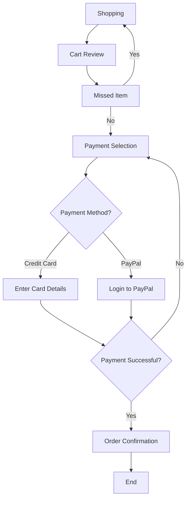

# Diagram For Online Checkout Process

# Documentation  
Shopping; the first step in the process where a user starts browsing, selecting items.

Related To Cart Review to review chosen products.

Cart Review: customer can review selected items in the shopping cart.

Relation:Invoked By Missed Item to fix any missed items.

If not skipping lines and there are no items missing then goes straight to Payment Selection.

Step 2 - Missed Item: Decision whether the user forgot any items

No: Moves to Choose a Payment Method.

Yes: Takes you back to Shopping to add the ones you missed.

( STEP 3 ) Payment Selection: Allow customer to select their payment method.

Renders to Payment Method?, through that specific payment type checkbox.

Payment Method? : A decision point offering:

Credit card: Links to Enter card details

PayPal: Redirect to Login to PayPal

The customer put their credit card information for processing payment.

The relationship: Relates to Payment Successful? to validate the payment.

PayPal Log In: Customer logs in to their PayPal account for authorization.

Relation: Related to Payment Successful? to validate the payment.

Payment Successful? : Indicates whether the payment succeeded.

Yes: Goes to Order Confirmation.

No : Redirect back to Payment Selection to Retry.

Order Confirmation: to confirm that the payment was successful and the order is placed.

Process: Transition to End Relationship, calling the process complete

End: Successful completion and tokenization of checkout, accompanied by confirmation.