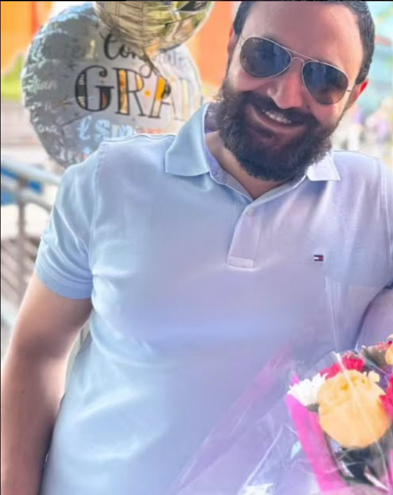
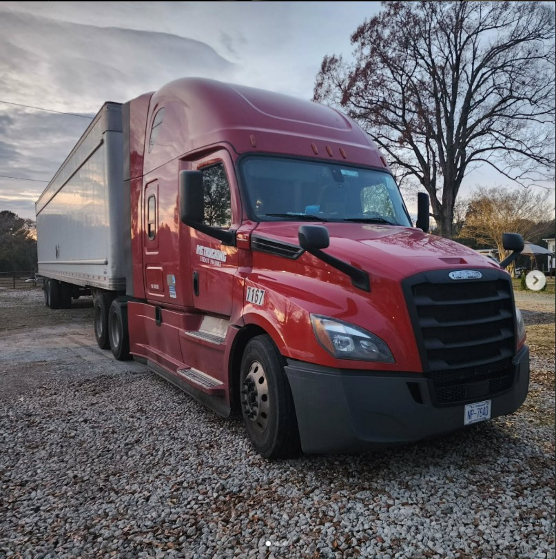

# ahmedmousa3.github.io  
  
  
**Name: Ahmed Mousa**  
**Email: asmousa@my.waketech.edu**  
**This is my school account**  
**_This repository will hold assignments_**  
[**_Click Here To See My GitHub_**](https://github.com/ahmedmousa3)  

# **About Me**
## **My Story**  
**I used to be a Truck driver, but now I am in Cybersecurity program**  
**This is the truck that I used to drive**  

    

## **Websites I Recommend**  
  - [Coursera](https://www.coursera.org/) - Coursera offers a wide range of  
    online courses from top universities and institutions.
  - [TryHackMe](https://www.tryhackme.com) - TryHackMe is an interactive platform  
    for learning cybersecurity through hands-on challenges.

